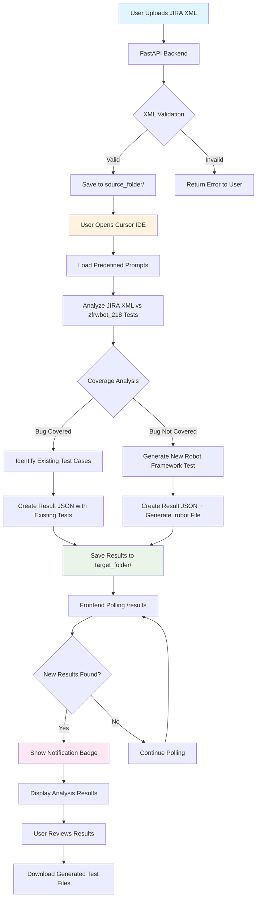
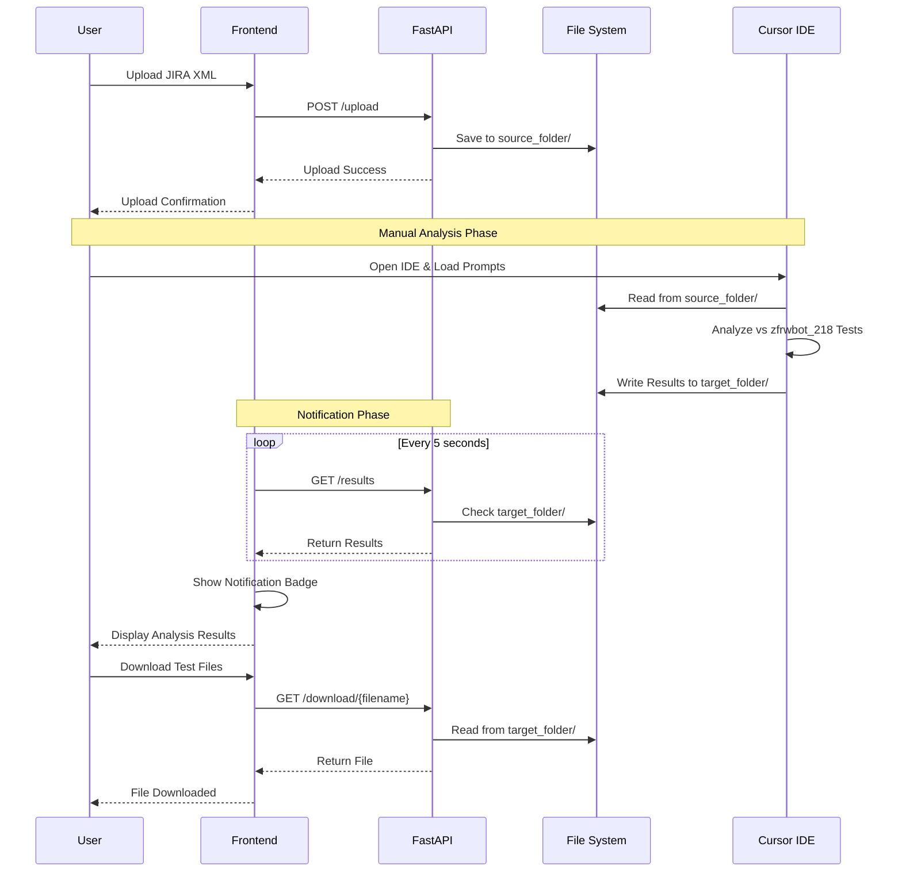
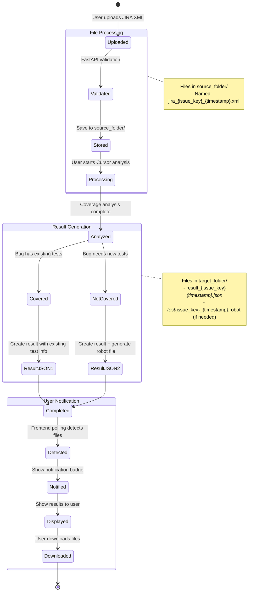
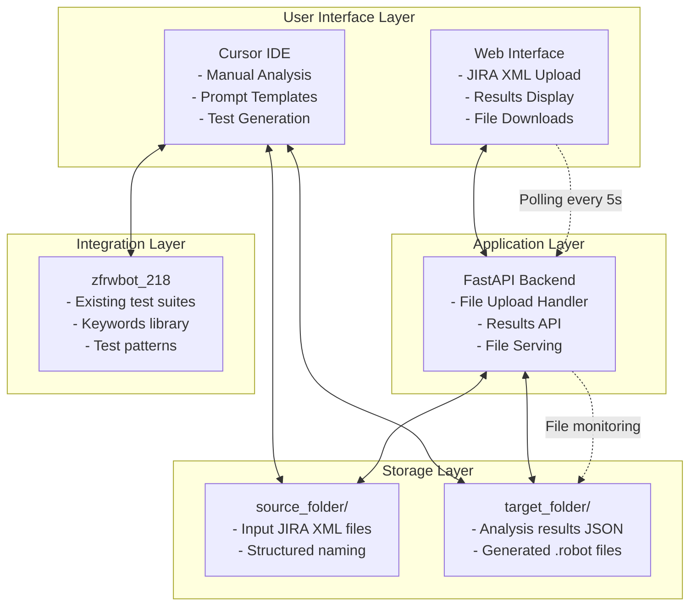
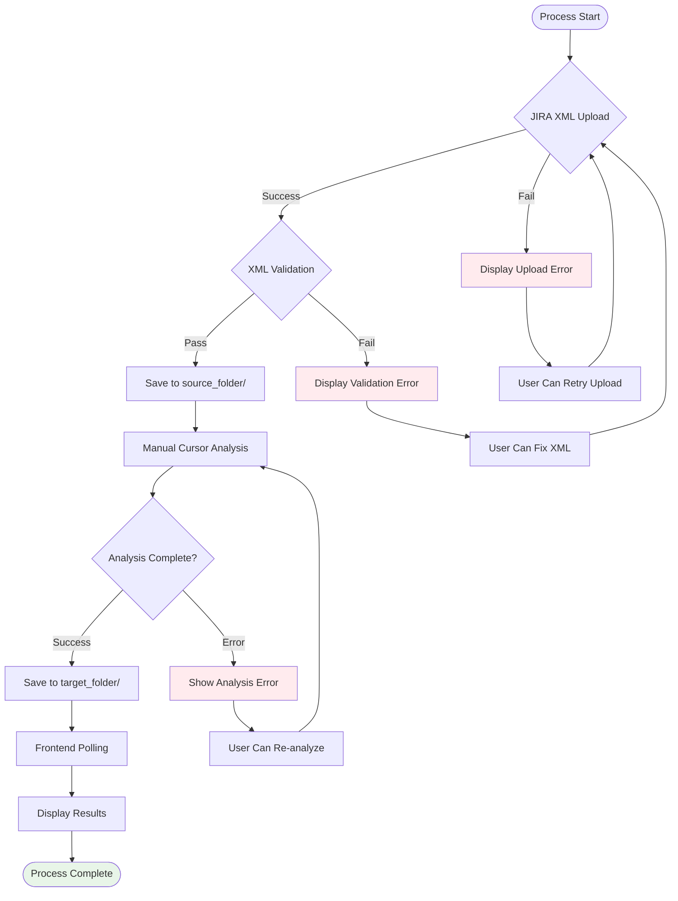

# High Level Design - Ruckathon2025

## Project Overview

**Bug and Test Case Analysis System MVP** - A one-day ruckathon project to create an AI-assisted system that analyzes Robot Framework test coverage against JIRA bug reports and generates new test cases for the zfrwbot_218 testing framework.

## System Architecture

### 1. Core Components

```
┌─────────────────┐    ┌─────────────────┐    ┌─────────────────┐
│   Web Interface │────│  FastAPI Backend │────│  Folder Storage │
│ (JIRA XML Upload)│    │  (Simplified)   │    │ source_folder → │
└─────────────────┘    └─────────────────┘    │  target_folder  │
                                │              └─────────────────┘
                                ▼
                       ┌─────────────────┐
                       │  Manual Cursor  │
                       │  IDE Analysis   │
                       └─────────────────┘
```

### 2. Technology Stack

- **Backend**: FastAPI (Python) - Simplified folder-based processing
- **Frontend**: Vanilla HTML/JavaScript - JIRA XML upload interface
- **AI Processing**: Manual Cursor IDE workflow with predefined prompts
- **Data Storage**: Folder-based system (source_folder → target_folder)
- **Input Format**: JIRA XML with structured bug information
- **Test Framework**: Robot Framework integration

### 3. Data Flow

1. **Input**: JIRA XML files with structured bug information (issue key, title, comments, metadata)
2. **Storage**: Backend saves uploaded XML to `source_folder/` for processing
3. **Manual Analysis**: User opens Cursor IDE and analyzes files using predefined prompts
4. **Coverage Assessment**: Cursor determines if bug is covered by existing zfrwbot_218 tests
5. **Output Generation**: Cursor writes results (coverage info or new test cases) to `target_folder/`
6. **Result Detection**: Frontend polling detects new result files in `target_folder/`
7. **User Notification**: Frontend displays notification badges and updates results section
8. **Results Display**: Users can view analysis results and download generated test files

## Architecture Details

### 3.1 FastAPI Backend (`main.py`)

**Endpoints**:
- `POST /upload` - JIRA XML file upload and validation
- `GET /results` - Poll target_folder for analysis results (returns new and all results)
- `GET /download/{filename}` - Download generated test files from target_folder
- `GET /` - Serve static HTML interface

**Core Functions**:
- JIRA XML file upload handling and validation
- Save uploaded files to `source_folder/` with structured naming
- Monitor `target_folder/` for analysis results
- Serve results and generated test files
- Basic file management (cleanup, organization)

### 3.2 JIRA XML Parser (`analysis_engine.py`)

**Responsibilities**:
- Parse JIRA XML files to extract structured data:
  - Issue key (e.g., UN-12686)
  - Issue title and summary
  - Detailed descriptions and comments
  - Priority, severity, and status information
  - Custom fields and metadata
  - Technical details from comment sections
- Validate XML format and structure
- Generate structured data for Cursor IDE analysis

### 3.3 Cursor Prompt Templates (`cursor_prompts.md`)

**Manual Workflow**:
1. User monitors `source_folder/` for new JIRA XML files
2. User opens Cursor IDE and loads predefined prompt templates
3. User analyzes JIRA bug against zfrwbot_218 test coverage using Cursor AI
4. **If Covered**: User identifies existing test cases and documents coverage
5. **If Not Covered**: User generates new Robot Framework test cases
6. User saves analysis results to `target_folder/` in structured format

### 3.4 Web Interface (`static/index.html`)

**Features**:
- Drag-and-drop JIRA XML file upload interface
- XML file validation and format checking
- Real-time polling of `target_folder/` for results (5-second intervals)
- Notification system with badges for new results
- Results visualization showing:
  - JIRA issue information (key, title, priority)
  - Test coverage status (covered/not covered)
  - Existing test case details or generated test previews
- Download links for generated Robot Framework test files
- Result tracking to avoid duplicate notifications

## Process Flow Diagram

### 4.1 Complete System Workflow



### 4.2 Component Interaction Diagram



### 4.3 Data Flow States and File Lifecycle



### 4.4 System Integration Overview



### 4.5 Error Handling Flow



## Result File Specifications

### 5.1 File Naming Conventions

**File Naming Pattern**: `{type}_{issue_key}_{timestamp}.{extension}`

```
target_folder/
├── result_UN-12686_20250729_163045.json    # Analysis result
├── test_UN-12686_20250729_163045.robot     # Generated test (if needed)
└── metadata_UN-12686_20250729_163045.json  # Processing metadata
```

### 5.2 Analysis Result JSON Format

```json
{
  "jira_issue": {
    "key": "UN-12686",
    "title": "[unleashed_200.19.7.1] Dropbear upgrade to v2022.82 cannot start on R770",
    "priority": "P3",
    "status": "Resolved",
    "component": "system"
  },
  "analysis": {
    "coverage_status": "not_covered",  // or "covered"
    "confidence": 0.85,
    "analysis_timestamp": "2025-07-29T16:30:45Z",
    "analyzed_by": "cursor_ide"
  },
  "result": {
    // If covered:
    "existing_tests": [
      {
        "test_file": "tests/system/dropbear_tests.robot",
        "test_case": "TLID-SYS-001 Test Dropbear Service Start",
        "relevance": "high",
        "match_confidence": 0.9
      }
    ],
    // If not covered:
    "generated_test_file": "test_UN-12686_20250729_163045.robot",
    "new_test_cases": [
      {
        "test_id": "TLID-NEW-001",
        "test_name": "Test Dropbear Upgrade Compatibility",
        "description": "Verify dropbear service starts after upgrade to v2022.82"
      }
    ]
  }
}
```

### 5.3 Generated Robot Framework Test Format

```robot
*** Settings ***
Documentation    Generated test for JIRA issue UN-12686
Library          SSHLibrary
Library          Process
Resource         ../resources/keywords/common.robot

*** Test Cases ***
TLID-NEW-001 Test Dropbear Upgrade Compatibility R770
    [Documentation]    Verify dropbear service starts after upgrade to v2022.82
    [Tags]    generated    regression    system    dropbear
    [Setup]    Test Case Setup
    
    Given Upgrade Dropbear To Version    v2022.82
    When Start Dropbear Service On R770
    Then Dropbear Service Should Be Running
    And SSH Connection Should Be Available
    
    [Teardown]    Test Case Teardown
```

## Frontend Notification System

### 6.1 Polling Strategy

**Implementation**:
```javascript
// Frontend polling every 5 seconds
async function pollForResults() {
    try {
        const response = await fetch('/results');
        const data = await response.json();
        
        if (data.new_results.length > 0) {
            showNotificationBadge(data.new_results.length);
            displayNewResults(data.new_results);
            updateResultsList(data.all_results);
        }
    } catch (error) {
        console.error('Polling error:', error);
    }
}

setInterval(pollForResults, 5000);
```

### 6.2 Backend Results Endpoint

**`GET /results` Response Format**:
```json
{
  "new_results": [
    {
      "jira_issue": { "key": "UN-12686", "title": "...", "priority": "P3" },
      "analysis": { "coverage_status": "not_covered", "confidence": 0.85 },
      "result": { "generated_test_file": "test_UN-12686_20250729_163045.robot" },
      "file_path": "target_folder/result_UN-12686_20250729_163045.json",
      "created_at": "2025-07-29T16:30:45Z"
    }
  ],
  "all_results": [ /* all previous results */ ],
  "timestamp": "2025-07-29T16:45:00Z"
}
```

### 6.3 User Notification Flow

1. **Upload**: User uploads JIRA XML → File saved to `source_folder/`
2. **Manual Processing**: User processes in Cursor IDE → Results saved to `target_folder/`
3. **Auto-Detection**: Frontend polling detects new files in `target_folder/`
4. **Notification**: Frontend shows notification badge and popup
5. **Display**: Results automatically appear in results section
6. **Download**: User can download generated test files

### 6.4 Visual Indicators

```html
<div class="results-section">
    <h3>Analysis Results 
        <span class="new-badge" id="newResultsBadge" style="display:none;">
            New
        </span>
    </h3>
    
    <div class="result-item new" data-issue="UN-12686">
        <div class="result-header">
            <span class="issue-key">UN-12686</span>
            <span class="status not-covered">Not Covered</span>
            <span class="timestamp">2 minutes ago</span>
        </div>
        <div class="result-content">
            <p>Generated new test case: TLID-NEW-001</p>
            <button class="download-btn" onclick="downloadTest('test_UN-12686_20250729_163045.robot')">
                Download Test File
            </button>
        </div>
    </div>
</div>
```

## Integration with zfrwbot_218

### 7.1 Input Compatibility

**JIRA XML Format**:
- Compatible with JIRA RSS XML export format
- Rich structured data including issue keys, titles, comments
- Technical details from comment sections provide context
- Custom fields with priority, severity, and metadata

**Example JIRA XML Structure**:
```xml
<item>
  <key id="1031365">UN-12686</key>
  <summary>[unleashed_200.19.7.1] Dropbear upgrade to v2022.82 cannot start on R770</summary>
  <comments>
    <comment>Technical details about the issue...</comment>
  </comments>
  <customfields>
    <customfield id="customfield_10079">
      <customfieldname>Priority</customfieldname>
      <customfieldvalue>P3</customfieldvalue>
    </customfield>
  </customfields>
</item>
```

### 7.2 Output Compatibility

**Generated Robot Framework Tests**:
- Follow zfrwbot_218 naming conventions
- Use existing keyword libraries from `resources/keywords/`
- Compatible with current test structure
- Ready for integration into appropriate test suites

**Example Output**:
```robot
*** Test Cases ***
TLID-NEW-001 Test Gateway PPPoE Connection After Upgrade
    [Tags]    generated    regression    gateway
    [Setup]    Test Case Setup
    Given Upload Firmware To Gateway AP
    When Configure Gateway Mode To PPPoE
    Then Check PPPoE Connection Is Stable After Upgrade
    [Teardown]    Test Case Teardown
```

## Technical Constraints & Solutions

### 8.1 Enterprise Constraints

**Constraints**:
- No external LLM API access
- No local LLM deployment allowed  
- Company policy prohibits sending data to remote services
- Only Cursor IDE available for AI capabilities

**Solution**:
- File-based manual workflow leveraging Cursor's built-in AI
- Local processing only, no external API calls
- Structured prompts to maximize AI effectiveness
- Human oversight for quality control

### 8.2 One-Day Development Constraints

**Time Limitations**:
- 8-hour development window
- Single developer implementation
- MVP demonstration required

**Design Decisions**:
- Minimal dependencies (FastAPI only)
- File-based storage (no database setup)
- Simple HTML interface (no complex frontend framework)
- Manual AI processing (no automation complexity)

## File Structure

```
mvp_bug_analysis/
├── main.py                 # FastAPI backend (~100 lines)
├── analysis_engine.py      # JIRA XML parsing (~80 lines)
├── cursor_prompts.md       # Manual prompt templates (~50 lines)
├── static/
│   └── index.html          # Web interface (~120 lines)
├── source_folder/          # Input: JIRA XML files
├── target_folder/          # Output: Analysis results
└── README.md              # Manual workflow instructions
```

## Success Metrics

### 9.1 Functional Requirements
- ✅ Parse JIRA XML files successfully (UN-12686 format)
- ✅ Upload and process structured JIRA bug reports
- ✅ Manual Cursor IDE workflow for test coverage analysis
- ✅ Implement result file specifications with JSON format and naming conventions
- ✅ Frontend notification system with polling and user alerts
- ✅ Produce valid Robot Framework test cases for uncovered bugs
- ✅ Integrate with zfrwbot_218 conventions and existing test structure

### 9.2 Demo Requirements
- ✅ 10-minute end-to-end demonstration with JIRA XML workflow
- ✅ Use real JIRA bug data (UN-12686 format) and zfrwbot_218 tests
- ✅ Show manual Cursor IDE analysis process with predefined prompts
- ✅ Demonstrate result file creation and frontend notification system
- ✅ Generate 2-3 practical test cases for uncovered bugs
- ✅ Show folder-based processing workflow with real-time updates

## Future Enhancements (Post-Ruckathon)

1. **Automation**: Direct integration with Cursor's MCP capabilities for automated analysis
2. **Batch Processing**: Handle multiple JIRA XML files simultaneously
3. **Real-time Updates**: WebSocket integration to replace polling for live folder monitoring
4. **Advanced JIRA Integration**: Direct JIRA API integration for automatic bug fetching
5. **Database**: PostgreSQL for persistent analysis tracking and history
6. **CI/CD Integration**: Automated pipeline integration for continuous coverage analysis